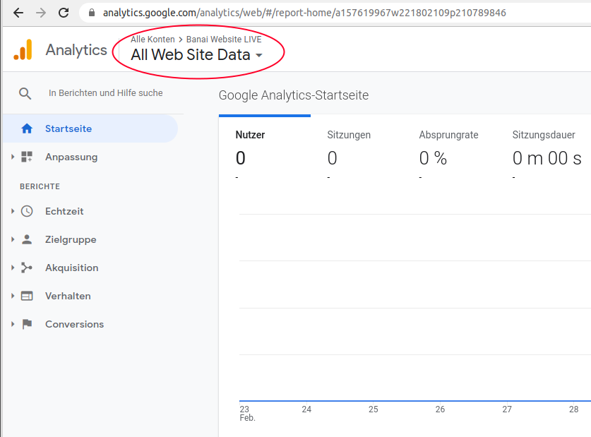
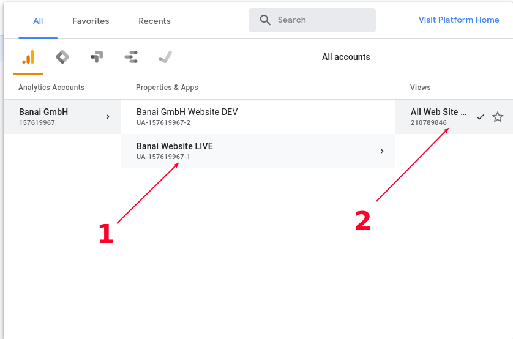
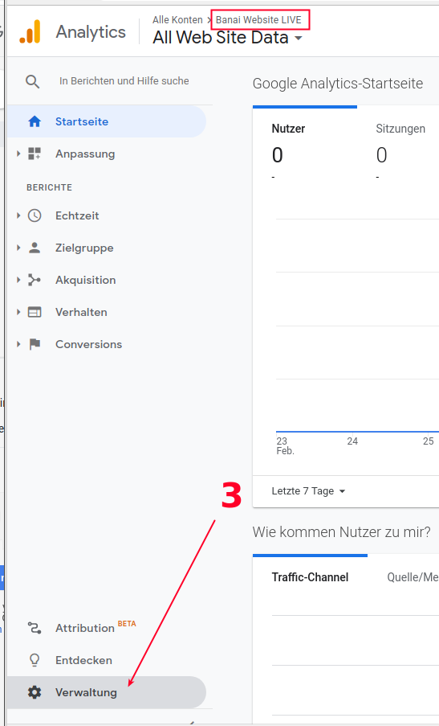
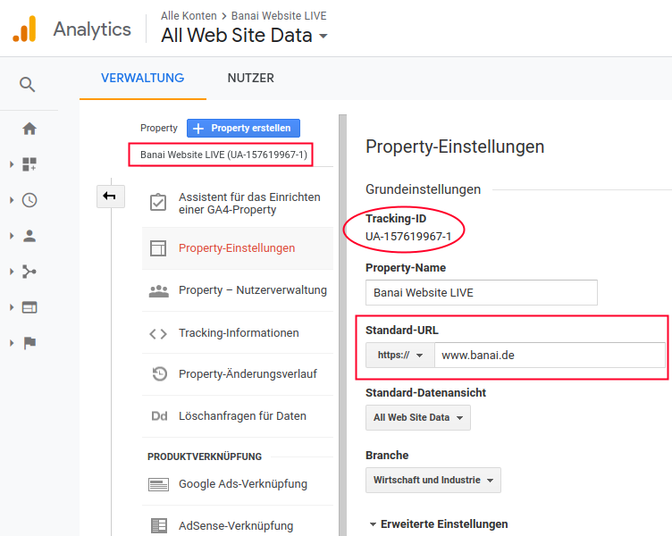

[&lt; BACK](./)

# Konfigurations-Einstellungen - Frontend - Google Analytics  

### ***--- WICHTIG: nicht vollständig! ---*** ###

Ein Google Analytics (GA) ***Tracking-ID*** wird benötigt und muss per Hand 
als Einstellung in die Frontend (der Website App) reingeschrieben werden.

## Google Analytics Schnittstelle

Erst die GA-Schnittstelle aufrufen: [https://analytics.google.com](https://analytics.google.com){:target="_blank"} 

Um die richtige ***Property*** auszuwählen, zunächst oben links auf "All Web Site Data" klicken, 



und anschließend auf "All Web Site Data" (rechts) klicken:



Jetzt ist die ***Property*** "Banai Website LIVE" selektiert, und unter ***Verwaltung*** 



bekommt man Zugang zu die ***Property-Einstellungen***, wo die ***Tracking-ID*** aufgelistet ist:



Hier muss auch die richtige ***Standard-URL***, sprich die Website-Adresse, eingetragen werden.

## App (Frontend) Konfiguration

Der Wert muss als folgende Variable in die Datei

    ``src/common/constants.js`` 

(in diesem Bespiel, 'UA-157619967-1') so reingeschrieben werden:

```jsx
export const ga_tracking_id = 'UA-157619967-1';
```

Eine Änderung in der App benötigt ein Rebuild, also

```bash
yarn build
```

Für Einzelheiten zum Aufbau der App (Frontend), siehe [hier](/tech-ui/). 


