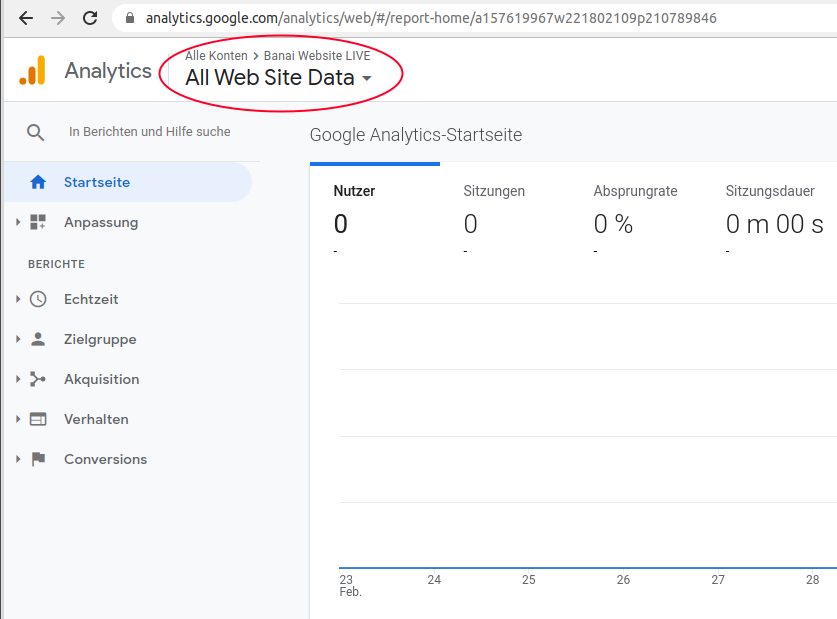
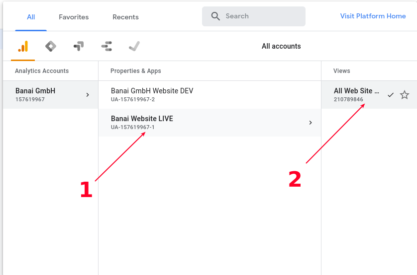
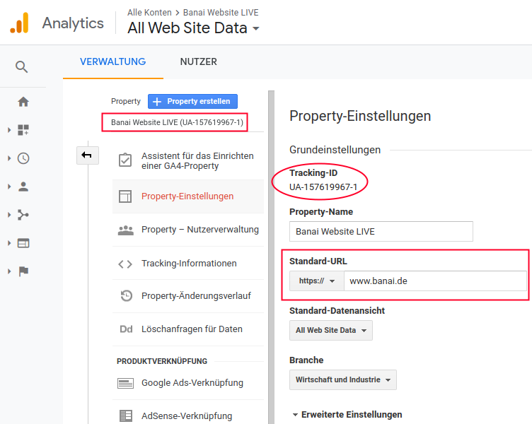

[&lt; HOME](./)

# Konfigurations-Einstellungen

### ***--- WICHTIG: nicht vollständig! ---*** ### 

Hier wird aufgelistet wichtige Konfiguration-Einstellungen zu den verschiedenen Schnittstellen, Dienste, usw.

## User Interface (Frontend)

### Google Analytics (GA)

Ein ***Tracking-ID*** wird benötigt und muss per Hand als Einstellung in die App reingefügt werden.

#### Vorgang

Erst die GA-Schnittstelle aufrufen: https://analytics.google.com 

Um die richtige ***Property*** auszuwählen, zunächst oben links auf "All Web Site Data" klicken, 

und anschließend auf "All Web Site Data" (rechts) klicken:

Jetzt ist die ***Property*** "Banai Website LIVE" selektiert, und unter ***Verwaltung*** 

bekommt man Zugang zu die ***Property-Einstellungen***, wo die ***Tracking-ID*** aufgelistet ist:

Hier muss auch die richtige ***Standard-URL***, sprich die Website-Adresse, eingetragen werden.

