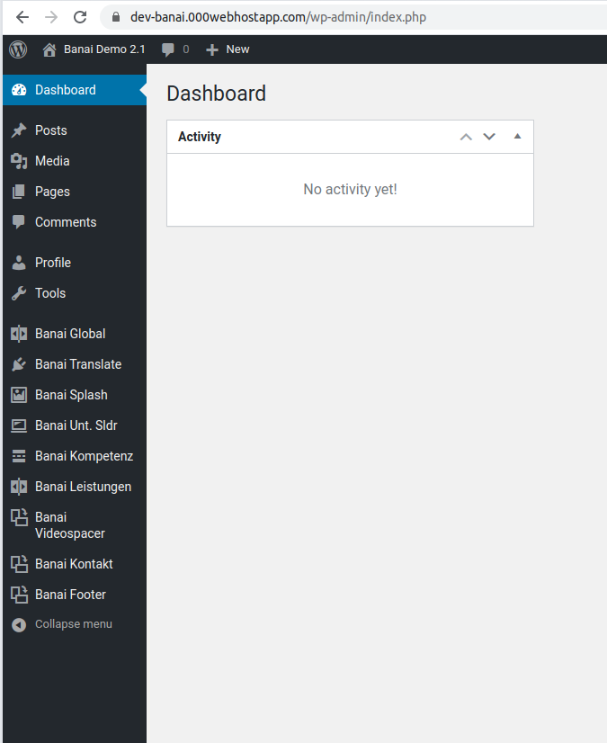

[&lt; HOME](./index)

# Anleitung zur Content-Management-System (CMS) Schnittstelle

## Intro

Das CMS ist auf Basis von Wordpress, ein ausgereifte und sehr weit verbreitete Open-Source Software, aufgebaut. 

Aber, um Sicherheit zu erhöhen und die Wartung effizienter zu machen, wird von Wordpress selber nur das Backend
in Gebrauch genommen, und nicht die Blogging- und Kommentar-Funktionen. Dazu werden auch keine Plugins, außer eigener
entwickelten, angewendet.

Übers CMS wird die Inhalte und ätliche Einstellungen der Website gesteuert.

## Zugang

URL: [https://dev-banai.000webhostapp.com/wp-admin/](https://dev-banai.000webhostapp.com/wp-admin/)

### Zugangskonten

Es gibt zwei Arten:

* Administrator (mit vollem Zugriff)

* Editor (mit eingeschränkten Rechten)

Benutzernamen  und Passwörter sind vom Entwicklungsteam erhältlich.

## Bedienung

Nach der Anmeldung erscheint eine schlichte Seite:

Aufgelistet links sind die Module oder Rubriken, die zu den bestimmten Teilen der Website gehören, 
oder im Falle "Banai Global", zur globalen Einstellungen.

